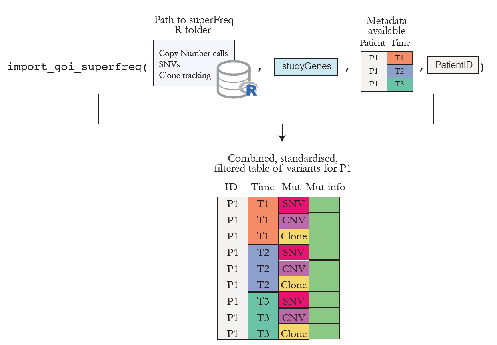
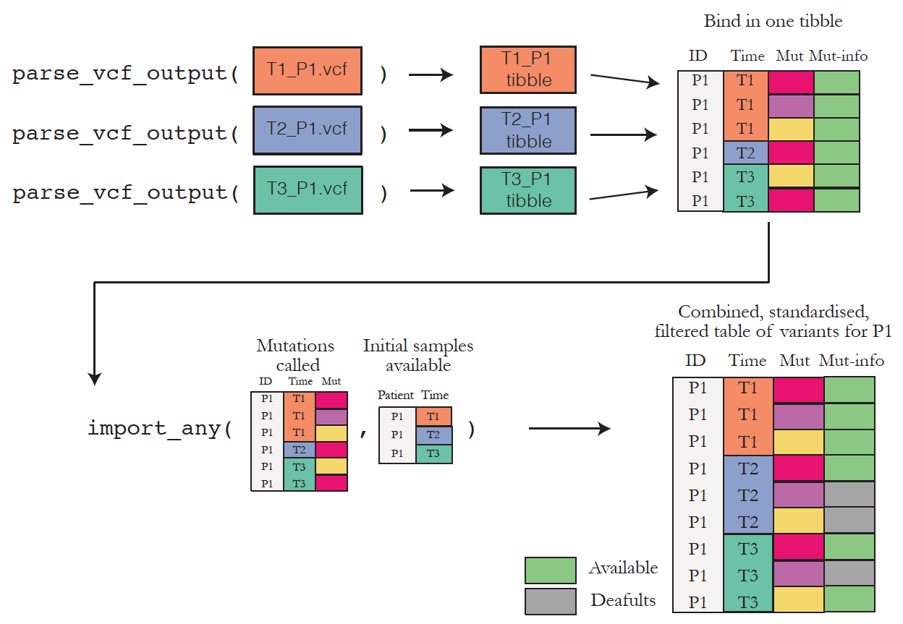

```{r setup, include=FALSE}
knitr::opts_chunk$set(echo = TRUE,
                      message = FALSE,
                      warning = FALSE,
                      collapse = TRUE,
                      comment = "#>")
```


# Find the spark joy in your variants!

Bioinformatics can be very overwhelming at times, with all its different file formats, fields specifications and many ways of storing the same things! That's how the `varikondo` package came to life. 
It was developed by the need to **re-organise**, **standardise** and **combine** variant calling outputs from several callers.

## Import variants from several callers

Variants from different callers can be imported in R and parsed into a data frame with standardised fields. See [how fields are standardaised](https://annaquaglieri16.github.io/varikondo/articles/standardise-variant-fields.html) to know more about which fields from each callers are parsed. The functions which achieve this are:

  * `import_goi_superfreq()`: to import variants found on genes of interest called by [superFreq](https://github.com/ChristofferFlensburg/superFreq), a caller that allows clonal tracking of cancer sequencing data. Figure 1 sketches how the function works. 
  
  
```{r superfreq-diagram,eval=TRUE,echo=FALSE,fig.cap="Figure 1. Overview of the functionality to import and organise superFreq outputs.",fig.asp=0.7}

```

  
  * `parse_vcf_output()`: which takes a [Variant Call Format (VCF)](http://www.internationalgenome.org/wiki/Analysis/Variant%20Call%20Format/vcf-variant-call-format-version-40/) file as input and outputs a parsed data frame with standardised names for the fields in the `VCF` file. Currently, `parse_vcf_output()` can parse ouputs from the following callers run in tumour-only mode: `GATK3 MuTect2`, `VarScan2`, `VarDict` and `Freebayes`. It also enables parsing of the annotation field added by the [Variant Effect Predictor](https://asia.ensembl.org/info/docs/tools/vep/index.html). 


## Combine variant calls from different samples within the same patient

  * `import_any()` combines and filters the variant calls (already imported into `R`) from several samples collected for the same patient. This functions attempts to mimic in a very simplistic way what is performed within [superFreq](https://github.com/ChristofferFlensburg/superFreq). Instead of filtering each variant callset separately for each sample, variants are filtered jointly by patient. This means that if a variant reaches minimal quality threshold at any time point, then it will be kept for all other time points. If a variant is not detected in some samples it will be filled with default values, e.g. `zero` variant allele frequency. This allows to have complete information for a variant across time for one patient and to plot and evaluate the shift in VAF or depth over time.
 

Below is a graphic overview of how the output of `parse_vcf_output()` and `import_any()` interact. The example is based on files for one patient but the same can be extended to any patient. 

```{r echo=FALSE,eval=TRUE, fig.cap="Figure 2. Overview of the functionality to import and organise your VCF files.",fig.asp=0.7}

```

