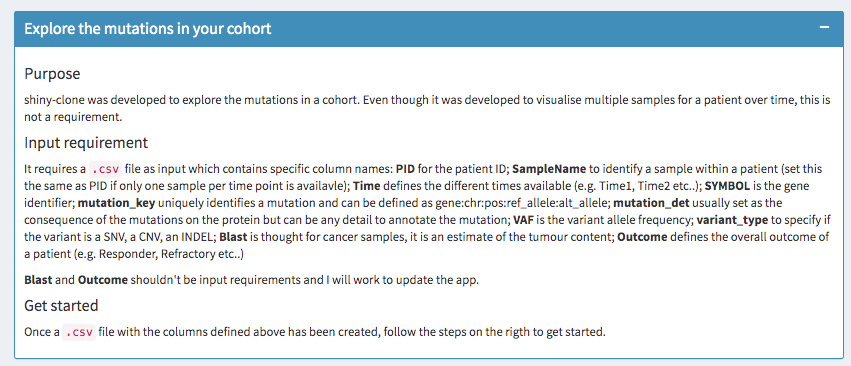
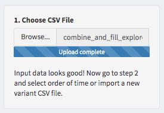
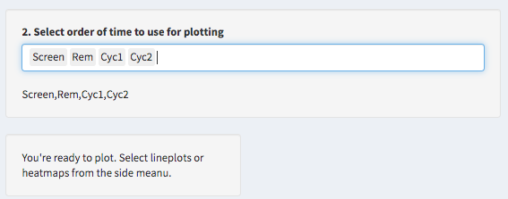
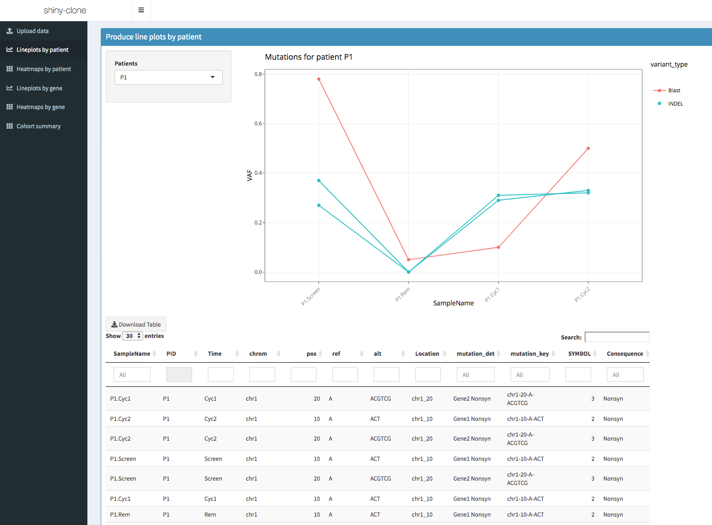

```{r setup, include=FALSE}
knitr::opts_chunk$set(echo = TRUE,
                      message = FALSE,
                      warning = FALSE,
                      collapse = TRUE,
                      comment = "#>")
```


# Setup 

`varikondo` comprises a suite of functions to convert output from purpuses superFreq [@Flensburg2018-ah], VarScan [@Koboldt2012-wx], VarDict [@Lai2016-ws], GATK3 Mutect2 [@Cibulskis2013-vv], and FreeBayes [@Garrison2012-cl] into standardised data frames into R.

First, let's load the package. 

```{r eval=FALSE}
library(devtools)
devtools::install_github("annaquaglieri16/varikondo")
```


```{r eval=TRUE}
library(varikondo)
utils::packageVersion("varikondo")
```

```{r}
ls("package:varikondo")
```

```{r}
library(dplyr)
library(ggplot2)
library(cowplot)
```


# Import and parse a single `VCF` 

The function `parse_vcf_output()` allows to convert a `VCF` file generated by one of four callers [`GATK3 MuTect2`](https://software.broadinstitute.org/gatk/documentation/tooldocs/3.8-0/org_broadinstitute_gatk_tools_walkers_cancer_m2_MuTect2.php), [`VarDict`](https://github.com/AstraZeneca-NGS/VarDict), [`VarScan`](http://varscan.sourceforge.net/), and [`FreeBayes`](https://github.com/ekg/freebayes) into a data frame with standardised fields. This is because different callers annotate the `INFO` field in the `VCF` ouput in different ways, using different names for read depth, variant allele frequency etc... The output from `parse_vcf_output()` can then be used as input for `combine_and_filter()` to combine variants and clinical information for different samples within the same patients and to fill in missing variants at specific time points. If the variants in the `VCF` file are also annotated with the Variant Effect Predictor (VEP) [@McLaren2016-lv], `vep = TRUE` will parse the extra fields. 

## Import only specific ranges of the VCF file

VEP might annotate the same variant multiple times, depending on whether a variants falls on several transcripts. VEP pastes together different annotations on the same line. `parse_vcf_output()` will reshape the input VCF and return it in a long format by stacking all the annotations one underneath each other. This has the potential to largely increase the size of the ouput file. To overcome this problem it is possible to read in R only restricted genomic regions at one time by specifying a `GRanges()` object in `parse_vcf_output(param = VariantAnnotation::ScanVcfParam())`. The `param` argument is directly passed to `VariantAnnotation::readVcf()` within `parse_vcf_output()`.

The example `VCF` files below were annotated with VEP. Also `chr20_varscan.vcf.gz`, `chr20_vardict.vcf.gz` are available as example. 

```{r include=TRUE,echo=TRUE}
annot_vcf_mutect <- system.file("extdata", "chr20_mutect.vcf.gz", package = "varikondo")
annot_vcf_mutect
```

`VCF` files from `VarDict`, `VarScan`, and `freebayes` can be parsed by specifying `caller = "vardict"`, `caller = "varscan"`, `caller = "freebayes"`.

```{r include=TRUE,echo=TRUE,eval=TRUE}
parsed_vcf_mutect <- varikondo::parse_vcf_output(vcf_path = annot_vcf_mutect, 
                                                 caller = "mutect",
                                                 sample_name = "Sample1",
                                                 vep = TRUE)
```

```{r parsed-vcf-mut}
knitr::kable(parsed_vcf_mutect[1:10,],caption = "Parsed MuTect2 output, from VCF to data frame.")
```


# `combine_and_filter()`: joint filtering and improved visualisation over time

This section is more focused on specific tasks that involve preparing the data for plotting changes over time (usually changes in the VAF). This was a recurring task within the clinical trial structures that led to the development of `varikondo`. This includes a not too large cohort of patients (`PID`) followed up over `Time`, usually before and after treatment, and for which some clinical information, like the percentage of tumour content, are collected over the course of the treatment. Patients usually have an overall `Outcome` reported, depending on whether they respond to treatment (e.g. Responders, Relapse, Refractory). A more detailed example is described in [`Example: variant calling in RNA-Seq`](https://annaquaglieri16.github.io/varikondo/articles/rna-seq-pipe.html). 

`parse_vcf_ouput()` imports one VCF file at a time. The function only support VCF input files which derive from calls done on one single sample. To analyse variants over time across multiple samples (within a patient or cohort-wise), one needs to filter and combine multiple variants files to create a combined dataset to be summarise or visualised. Some variant callers like superFreq or MultiSNV [@Josephidou2015-cy] are built with this purpose. However, these programs might not be suitable in specific scenarios, like calling complex INDELs in RNA-Seq.

`combine_and_filter()` helps with this. `combine_and_filter()` takes in input the combined data frame of variants imported with `parse_vcf_output()` and stacked together with functions like `rbind()` or `bind_rows()`; a `patientID`; a set of `studyGenes` if available; and some quality threshold to use for filtering. The output will be a *filtered* and *filled* data frame. 

* *Filtered*. Similarly to `import_goi_superfreq()`, variants are kept of only if they pass the defined thresholds at one time point within a patient. 

* *Filled*. If a variant is called at one time point but not found at others, `combine_and_filter()` imputes `0` default values for VAF, alt_depth and ref_depth. This feature was added to allow that all patient's time points available in the `clinicalData` (metadata) are represented for every variant. This allows a complete visual assessment of a variant over time. If this is not of interest to the user, variants with `VAF == 0` can be filtered out. 

Below is an illustrative example with sample data, adapted from the type of clinical trials that we usually work on.

```{r example-variants}
sample_variants <- example_variants
knitr::kable(example_variants)
```

```{r example-metadata}
sample_metadata <- example_metadata
knitr::kable(example_metadata)
```

`import_clinical()` was developed with the mere function to reshape clinical data, like % blast content ( = tumour content), into the same format as we store variants information to make it easier to be combined and plotted together with the VAF over time.

This can be useful to compare patient's clinical assessment with the cancer molecular response to treatment. For example, there can be cases where even though the patient does not seem to respond to treatment (tumour content does not drop after treatment), some cancer variants do individually respond. 

```{r import-any-patient1,eval=TRUE,warning=FALSE,message=FALSE}
combine_and_fill <- varikondo::combine_and_filter(variants = sample_variants,
                               patientID = "P1",
                              # studyGenes = c("Gene1","Gene2","Gene3"),
                               clinicalData = sample_metadata,
                               min_vaf = 0.05,
                               min_alt = 2)

knitr::kable(combine_and_fill,caption = "Output from combine_and_filter() for patient P1 in example_variants.")
```


```{r import-clinical-patient1,eval=TRUE,warning=FALSE,message=FALSE}
import_blast <- varikondo::import_clinical(clinicalData = sample_metadata,
                                patientID = "P1",
                                extract_column = "Blast") 
knitr::kable(import_blast,caption = "Output from import_clinical() for patient P1 in example_metadata.")
```


```{r plot-patient1,eval=TRUE,warning=FALSE,message=FALSE}
variants <- example_variants %>% 
  bind_rows(import_blast)

p1 = variants %>%
  filter(PID %in% "P1") %>%
 ggplot(aes(x = Time, y = VAF,colour = mutation_det,group = mutation_key)) +
  geom_point() + 
  geom_line() + 
  theme_bw() + 
  theme(legend.position = "bottom") +
  ggtitle("P1 - before combine_and_filter()")


combine_and_fill <- combine_and_fill %>% 
  bind_rows(import_blast)

p2 = ggplot(combine_and_fill,aes(x = Time, y = VAF,
                               colour=mutation_det,group=mutation_key)) +
  geom_point() + 
  geom_line() + 
  theme_bw()+ 
  theme(legend.position = "bottom") +
  ggtitle("P1 - after combine_and_filter()")

legend = get_legend(p1)

sec1 <- plot_grid(p1 + theme(legend.position = "none"),
          p2 + theme(legend.position = "none"))
plot_grid(sec1,
          legend,nrow=2,rel_heights = c(4,1))
```


# Import standardised `superFreq` output

`import_goi_superfreq()` was built to import the output produced by [`superFreq`](https://github.com/ChristofferFlensburg/superFreq), normally stored in nested lists within each patient's `Rdata` file or in `.csv` files. `superFreq` is used to perform clonal tracking of cancer genomes over time and therefore produces temporal output for somatic SNVs, short INDELs, CNVs and clones. A `superFreq` run (see [instructions](https://github.com/ChristofferFlensburg/superFreq)) will create and `R` folder with results stored in separate folder by patient. `import_goi_supefreq(superFreq_R_path, patientID = "P1)` will look into this folder to extract all the results for patient `P1`. 

Usually, collaborators might be interested in summarising a particular subset of genes of interest which can be passed to `import_goi_supefreq()` as a character vector in `studyGenes`. If no `studyGenes` are provided, variants on all genes are returned. `ref_genome` is necessary since `superFreq` stores variants using a different system of genomic coordinate which needs to be converted back to cDNA locations. Other variant threshold (`min_vaf` and `min_alt`) can be used to filter variants. Within a patients, only variants which pass those thresholds at any time point will be kept. 

```{r eval=FALSE}
import_sf <- varikondo::import_goi_superfreq(superFreq_R_path = superFreq_R_path,
   superFreq_meta_path = superFreq_meta_path,
  patientID = patientID,
  studyGenes = "KIT"
  ref_genome = "hg38",
  min_vaf = 0.05,
  min_alt = 3)
```

# Explore variants interactively

Now that variants are standardised and combined, it is possible to explore them interactively using the Shiny App https://shiny.wehi.edu.au/quaglieri.a/shiny-clone/. 




Just save the combined dataset into a `.csv` file and load it into https://shiny.wehi.edu.au/quaglieri.a/shiny-clone/.

```{r eval=FALSE}
write_csv(combine_and_fill, "../inst/combine_and_fill_explore.csv")
```




Finally, before starting to explore, select the order in which the time variable should be plotted. 



Start plotting!




# Bibliography
