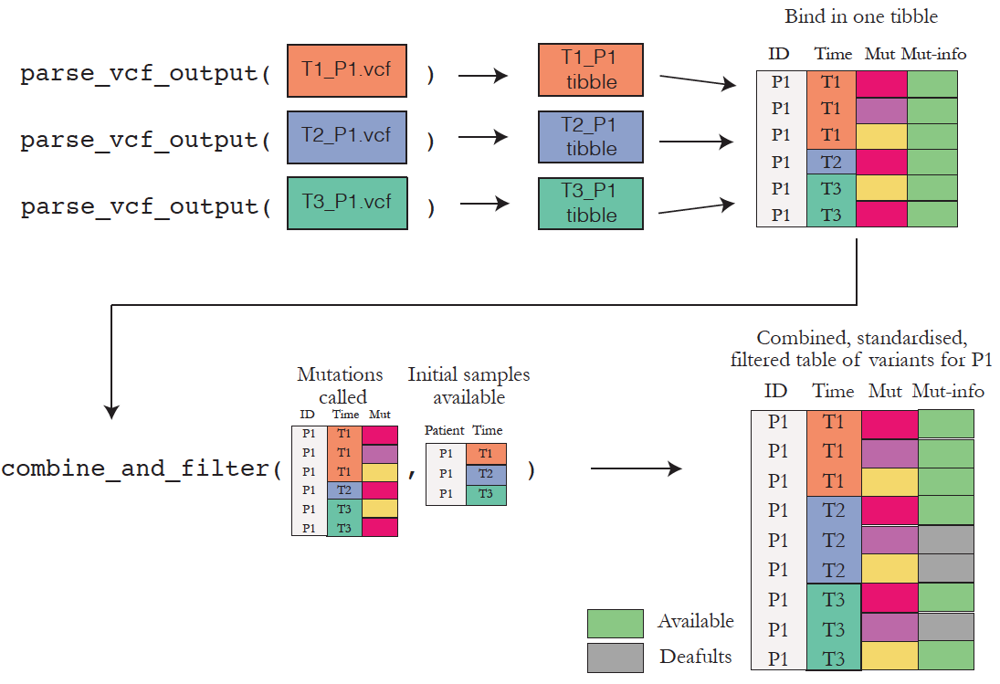

```{r setup, include=FALSE}
knitr::opts_chunk$set(echo = TRUE,
                      message = FALSE,
                      warning = FALSE,
                      collapse = TRUE,
                      comment = "#>")
```


# Setup 

The `varikondo` R package comprises several helper and import functions that can be used to convert output from any of the callers mentioned above to a standardised format.

```{r eval=FALSE}
library(devtools)
devtools::install_github("annaquaglieri16/varikondo")
```


```{r eval=TRUE}
library(varikondo)
```

```{r}
ls("package:varikondo")
```

# Parsing: from `VCF` to tidy data frame

The function `parse_vcf_output()` allows to convert a `VCF` file generated by three different callers `GATK3 MuTect2`, `VarDict` or `VarScan`, to a data frame with standardised fields. This is because different callers annotate the `INFO` field in the `VCF` ouput in different ways, using different names for read depth, variant allele frequency etc... The output from `parse_vcf_output()` can then be used as input `variants` for `import_any()` to combine variants and clinical information and fill in missing variants at specific time points. If the variants in the `VCF` file were also annotated with the Variant Effect Predictor (VEP) [@McLaren2016-lv], the one can set `vep = TRUE` to parse the extra fields. 

It is to be noted that `VEP` might annotate the same variant multiple times, depending on whether a variants falls on several transcripts. VEP pastes together different annotations on the same line. `parse_vcf_output` will reshape the input variants and return it in a long format by stacking all the annotations one underneath each other. This has the potential of largely increasing the size of the ouput file and it is suggested to subset variants based on genes of interest, if the input `VCF` file is too large.   

The `parse_vcf_output` functions is built on top of the [`VariantAnnotation`](https://bioconductor.org/packages/release/bioc/html/VariantAnnotation.html) Bioconductor package [@Obenchain15072014] to quickly read large `VCF` files into `R` and extract fields. The article [Standardise VCFs output across callers](file:///Volumes/AML_RNA/quaglieri.a/R_packages/varikondo/docs/articles/standardise-variant-fields.html) describes what fields are extracted from a caller's `VCF` file to populate the joyful standardised fields given in ouput.


Below is a graphic overview about how to parse a list of `VCF` files for one sample. The same can be extended for any patient. 

```{r echo=FALSE,eval=TRUE, fig.cap="Overview of the functionality to import and organise your VCF files.",fig.asp=0.7}

```


The example `VCF` files below were annotated with VEP. Also `germline_varscan.vcf` and `germline_vardict.vcf` are available as example. 

```{r include=TRUE,echo=TRUE}
annot_vcf_mutect <- system.file("extdata", "germline_mutect.vcf", package = "varikondo")
annot_vcf_mutect
```

`VCF` files from `VarDict` and `VarScan` can be parsed by specifying `caller = "vardict"` or `caller = "varscan"`.

```{r include=TRUE,echo=TRUE,eval=TRUE}
parsed_vcf_mutect <- varikondo::parse_vcf_output(vcf_path = annot_vcf_mutect, 
                                                 caller = "mutect",
                                                 sample_name = "Sample1",
                                                 vep = TRUE)
```

```{r parsed-vcf-mut}
knitr::kable(parsed_vcf_mutect[1:10,],caption = "Parsed MuTect2 output, from VCF to data frame.")
```


# Import functions

In general, the import functions can take in input variants called by a caller as well as clinical information for all the patients in the cohort under investigation. Every input function requires a `patientID` to be provided and a set of `studyGenes` to restrict the analysis on. `studygenes` are expected to be a character vector of NCBI gene `Symbols`. This means that variants need to be annotated with the gene they belong to before `varikondo` can be used. The clinical data at every time point is needed because if a variant is not detected at one time point for a patient, then the input variants will be extended to include all time points initially available for that patient but with default values for missing fields (e.g. VAF = 0). This is useful for visualisation purposes where one needs to track the development of mutation over time.


## Import, combine and standardise `superFreq` outputs


```{r eval=TRUE,echo=FALSE,fig.cap="Overview of the functionality to import and organise superFreq outputs.",fig.asp=0.7}
knitr::include_graphics("../man/figures/import-superfreq.png")
```

The `import_goi_superfreq()` function was specifically build to extract all the outputs produced by the caller which would be otherwise stored in nested lists within each patient's `Rdata` file or in `.csv` file if sometic variants. `superFreq` produces output from sometic SNVs, CNVs and clone tracking. A `superFreq` run for a cohort of patients (view [instructions](https://github.com/ChristofferFlensburg/superFreq)) will create and `R` folder with results for each patient, each stored within a folder. `import_goi_supefreq` will look into this folder to extract all the results. `import_goi_supefreq` also needs a path to the cohort metadata file in order to match the ouput from each sample with its patient name and time points.  

```{r eval=FALSE}
import_sf <- import_goi_supefreq(superFreq_R_path = superFreq_R_path,
                                 superFreq_meta_path = superFreq_meta_path,
                                 studyGenes,
                                 patientID = "D1",
                                 ref_genome = "hg38",
                                 VAFcut = 0.15)
```

# Aknowledgements

